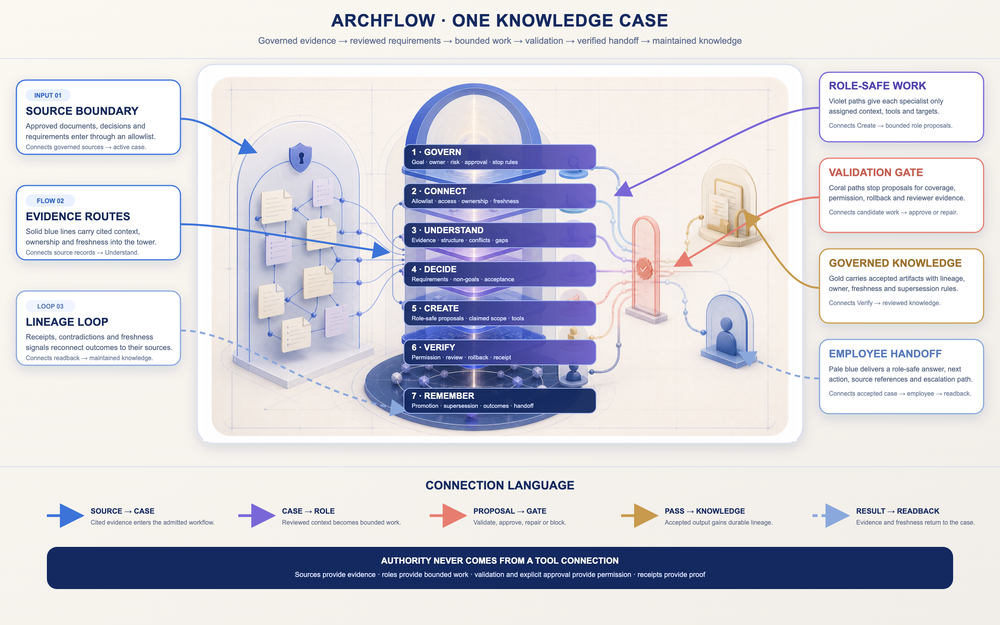

# ArchFlow Public Project

This folder is the clean public-safe project root for the ArchFlow reset.

All active work after the 2026-06-24 reset belongs under `project/`.
Prior work is represented only as sanitized English summaries under `history/`.

## Start Here

**ArchFlow turns scattered product knowledge into a reviewable operating system before the next high-stakes handoff.**

Choose the path that fits you:

- **Service buyer:** start with the [Knowledge Reliability Setup](project/agentic-stack.md#service-company-operating-model) and use the repository to understand the governed handoff you receive.
- **Operator or new employee:** start with the [unified operating architecture](docs/unified-operating-architecture.md) and [onboarding knowledge agent](docs/onboarding-knowledge-agent.md); the dashboard remains a legacy-compatible, browser-local projection until its separate migration plan is executed.
- **Self-hosting evaluator:** follow the [quickstart](docs/quickstart.md), review the [architecture](docs/architecture.md), and use only public-safe example data.

The product is intentionally local-first. Its current public implementation explains and validates contracts, generated catalog data, browser-local drafts, and guarded review packets. It does not claim an active hosted agent platform.

## Architecture At A Glance

[](project/assets/architecture/archflow-knowledge-process-labeled.png)

*Every layer, connection direction, and process meaning is labeled inside the image. Select it to open the full-resolution 2560 × 1600 version. The coral gate prevents a proposal from becoming an action until requirements, permissions, side effects, rollback, and reviewer evidence agree.*

### What Each Visual Region Means

| Visual region | Process meaning |
|---|---|
| **Shielded evidence vault — left** | Approved documents, decisions, requirements, and source records enter through an explicit corpus boundary. The shield means access is allowed by policy, not merely because a connector can read a file. |
| **Seven-level glass tower — center** | One Knowledge Case Controller carries the same objective, evidence lineage, requirements, role assignments, review state, and receipts through every stage. Each floor narrows uncertainty without expanding authority. |
| **Radiant cube — tower crown** | The admitted objective and current case identity. Every downstream role works from this same reviewed case rather than creating a competing source of truth. |
| **Specialist role rail — right of tower** | Bounded agents receive only the context, tools, targets, and permissions required for their assigned role. Different colors represent different work specialties, not different authority levels. |
| **Coral validation gate — center-right** | Proposals stop here for requirement coverage, permission, currentness, side-effect, rollback, maker-reviewer separation, and exact-approval checks. Failed work returns for repair; it does not flow around the gate. |
| **Golden knowledge portal — upper-right** | Accepted decisions, PRDs, research, designs, and reusable lessons may become governed project knowledge only after lineage, ownership, freshness, and supersession checks. |
| **Blue employee portal — lower-right** | A new employee or operator receives a role-safe answer, validated next action, escalation path, and source references—not unrestricted access to the whole knowledge base. |
| **Knowledge graph — tower base** | Provenance, dependencies, contradictions, receipts, and readback reconnect results to their sources. This is the feedback loop that keeps the system maintained instead of becoming a static document archive. |

### The Seven Layers

1. **Govern** — objective, owner, risk, run profile, approval class, and stop conditions.
2. **Connect** — source allowlist, access boundary, ownership, freshness, and exclusions.
3. **Understand** — lexical/LlamaIndex prose evidence plus Orbit/Graphify structural evidence.
4. **Decide** — reviewed requirements, contradictions, non-goals, acceptance checks, and decisions.
5. **Create** — onboarding, research, planning, copy, outreach, design, and implementation proposals.
6. **Verify** — validation, independent review, repair, exact approval, execution receipt, and readback.
7. **Remember** — selective knowledge promotion, supersession, freshness triggers, outcomes, and handoff.

### How The Connections Reflect The Process

| Connection | Meaning |
|---|---|
| **Solid blue lines** | Admitted source evidence and role-safe context moving into the case or to an assigned role. |
| **Violet lines** | Reviewed requirements and decisions being transformed into a bounded work proposal. |
| **Coral lines** | A proposed change approaching the validation gate, returning for repair, or waiting for exact approval. |
| **Gold lines** | Accepted output moving to a governed artifact or reviewed knowledge destination. |
| **Pale blue return lines** | Readback, employee feedback, verification evidence, or a freshness signal returning to the case. |
| **Linked nodes at the base** | Durable lineage: what changed, which source supported it, who reviewed it, what it affected, and when it must be checked again. |

### Meet The ArchFlow Agents

These are fictional Ukrainian call names written in English letters. They make the workflow easier to discuss, but they do not replace the stable role IDs or grant authority. Machine permissions remain defined by the [role catalog](project/system/contracts/role-catalog.json).

<details>
<summary><strong>Open the complete 21-agent roster</strong></summary>

| Call name | Stable role | Human responsibility | Primary connection |
|---|---|---|---|
| **Yaromyr** | Goal and Architecture Operator · `goal_and_architecture_operator` | Defines the objective, done conditions, state design, and role/gate contract. | Starts the vertical tower path. |
| **Bohdan** | Admission Controller · `admission_controller` | Classifies risk, selects the run profile, sets minimum roles, and enforces stop rules. | Opens or blocks entry to the tower. |
| **Solomiia** | Source and Context Operator · `source_and_context_operator` | Builds the allowlist, stable context, bounded retrieval, and evidence capsule. | Connects the shielded evidence vault to the case. |
| **Oksana** | Requirements and Market Research · `requirements_and_market_research` | Produces evidence-linked requirement, PRD, ICP, market, pain, and acceptance candidates. | Moves evidence into the Decide layer; cannot approve it. |
| **Taras** | Onboarding Guide · `onboarding_guide` | Gives a new employee the smallest role-safe context and proposes a validated first action. | Connects the case to the blue employee portal. |
| **Danylo** | Task and Handoff Planner · `task_and_handoff_planner` | Builds dependencies, bounded task packets, checks, and owner questions. | Routes reviewed decisions into executable work packets. |
| **Olena** | Positioning and Copy Maker · `positioning_and_copy_maker` | Creates evidence-linked positioning, message, caption, and claim candidates. | Converts approved pain evidence into bounded communication. |
| **Andrii** | Qualification and Channel Planner · `qualification_and_channel_planner` | Verifies target currentness, role, stage, channel, and send prerequisites. | Routes outreach candidates toward review, never directly to sending. |
| **Kateryna** | Designer · `designer` | Owns visual briefs, scene grammar, editable artifacts, accessibility evidence, and rollback-safe design output. | Turns reviewed requirements into visual proposals. |
| **Dmytro** | Implementation Maker · `implementation_maker` | Changes only claimed files or exact approved targets and records focused checks. | Builds the candidate output before the coral gate. |
| **Iryna** | Action Validator · `action_validator` | Checks requirement coverage, permissions, effects, rollback, and approval class. | Controls the first half of the coral gate. |
| **Mykola** | Verifier · `verifier` | Runs deterministic checks, identifies regressions, and records readback evidence. | Sends proof or repair evidence through the return line. |
| **Halyna** | Independent Reviewer · `independent_reviewer` | Issues APPROVE, REVISE, or BLOCK without silently repairing the maker's work. | Controls the maker-reviewer boundary at the gate. |
| **Larysa** | Knowledge Librarian · `knowledge_librarian` | Checks duplicates, lineage, ownership, supersession, freshness, and promotion readiness. | Controls entry to the golden knowledge portal. |
| **Maksym** | Integrator · `integrator` | Coordinates claims, merge order, conflicts, shared surfaces, final receipts, and handoff. | Reconciles every branch back into one case. |
| **Pavlo** | External Action Operator · `external_action_operator` | Performs one exact owner-approved external action with preflight, receipt, and readback. | Crosses the gate only after target-specific approval. |
| **Nazar** | Release Operator · `release_operator` | Prepares release evidence and performs an owner-approved Git push or release handoff. | Connects verified work to the approved release destination. |
| **Zoriana** | Growth and Outcome Analyst · `growth_and_outcome_analyst` | Separates observed outcomes from modeled scenarios and recommends pursue, pivot, or stop. | Feeds measured outcomes back to the knowledge graph. |
| **Ostap** | Observability and Efficiency Observer · `observability_and_efficiency_observer` | Reports runtime drift, usage evidence, and reproducibility gaps without completion authority. | Watches the pale blue feedback loop. |
| **Marta** | Surface Projection Operator · `surface_projection_operator` | Creates truthful read-only views, review packets, and export handoffs without owning source truth. | Projects case state to human-facing surfaces. |
| **Roman** | Product Packaging Engineer · `product_packaging_engineer` | Plans clean-clone packaging, least-privilege adapters, install, upgrade, uninstall, and rollback proof. | Turns a reviewed system into an adaptable package; this role remains planned. |

</details>

## Three-Minute Local Demo

```bash
python3 project/scripts/generate-dashboard-data.py
python3 -m http.server 8765
```

Open `http://127.0.0.1:8765/project/dashboard/#manual`, choose **Knowledge Service**, and prepare a local report. Download/review it, then use **Agent Control** to prepare a role handoff. The animated stage sequence is browser-local only. It never creates repository files, launches a subagent, calls a provider, or pushes Git.

## Documentation

- [Documentation index](docs/index.md) — canonical navigation and status/supersession legend.
- [Unified operating architecture](docs/unified-operating-architecture.md) — one knowledge case, normalized roles, evidence, validation, review, and promotion.
- [Onboarding knowledge agent](docs/onboarding-knowledge-agent.md) — role-safe employee support and requirement-validated action proposals.
- [Executed role and knowledge trace](docs/executed-role-and-knowledge-trace.md) — how research, outreach, creative, design, review, and promotion became role contracts.
- [Adapt ArchFlow](docs/adapting-archflow.md) — replace the synthetic fixture without weakening boundaries.
- [Orbit Local adapter](docs/orbit-local-integration.md) — optional code-structural evidence with a strict private runtime seam.
- [Dashboard integration plan](docs/dashboard-integration-plan.md) — future plan only; no dashboard migration is claimed.
- [Quickstart](docs/quickstart.md) — clean-clone local setup and verification.
- [Dashboard operating manual](docs/dashboard-operating-manual.md) — two-stage knowledge/agent-control flow, Jarvis prompts, configuration points, skills, roles, outputs, and limits.
- [Architecture](docs/architecture.md) — seven grouped layers and the long-term product path.
- [Operations](docs/operations.md) — input meanings, stage sequence, review-bundle workflow, and real-action gates.
- [API contract](docs/api-contract.md) — guarded API shapes and fail-closed behavior.
- [Security and data boundaries](docs/security-and-data-boundaries.md) — what may be public, local, or gated.
- [Contributing](CONTRIBUTING.md) and [security reporting](SECURITY.md).

## What Is Gated Or Not Included

- No provider-backed model execution by default.
- No autonomous files, Git changes, Git push, Notion/Nexus memory writeback, deployment, or external action from the browser.
- No customer corpus, private source ingestion, credentials, device paths, or public copy of the operator's larger private skill inventory.
- No live database or arbitrary SQL console. The dashboard Data Lab is a read-only preview over generated public JSON.
- No production, availability, ROI, demand, or continuous-monitoring claim without current evidence.

## Public Boundary

This folder is intended to be safe to push to a public Git repository.

Rules:

- Use English only.
- Use repo-relative paths only.
- Do not store personal names, private workspace links, local absolute paths, user IDs, account IDs, API keys, tokens, cookies, passwords, or raw credentials.
- Do not copy raw Notion exports, old PDFs, screenshots, Vercel metadata, API files, browser logs, or private source files into this folder.
- Store provider settings only as examples or non-secret configuration.
- Treat Codex as the operator runtime. Do not claim Codex auth is an API key for external frameworks.

## Folder Map

| Folder | Purpose |
|---|---|
| `project/` | Current post-reset project, operating rules, plan, agent stack, provider setup. |
| `history/` | Public-safe summaries and inventories of pre-reset ArchFlow work. |
| `skills/` | Skills and agent hooks used for this project. |
| `wiki/` | Public WikiLLM memory layer for project instructions, runs, decisions, issues, and insights. |

## Current Project Direction

ArchFlow is a knowledge-continuity operating system for companies that need a maintained, source-grounded company brain and bounded agent execution.

The current service wedge is:

`forcing moment -> source and ownership map -> reviewed knowledge spine -> governed agent workflows -> measured handoff`

PRDs, ICPs, content, outreach, and other execution packs are generated architectures inside that system; they are not the whole product identity.

The current public-safe implementation includes:

- a provider-disabled unified knowledge-case contract with synthetic onboarding and action-validation fixtures;
- a three-block buyer-facing website built around the seven-layer ArchFlow tower, two delivery lanes, and a disclosed planning calculator;
- a documentation-first operator dashboard for architecture, knowledge, roles, skills, workflow state, runs, and proof;
- a separate provider-disabled Jarvis surface with owner, model-allowlist, and acknowledgement checks plus a mandatory durable-control execution block;
- an E1-E8 plan whose final gated milestone is a locally installable repository, least-privilege MCP, administration plane, and lifecycle documentation.

Local implementation proof does not establish production deployment, live provider execution, validated demand, or autonomous writeback.

The two delivery lanes and numbered dashboard labels are compatibility surfaces, not the canonical system architecture. PRDs, ICPs, market research, content, outreach, and creative work are bounded role outputs inside one governed knowledge-case workflow.
