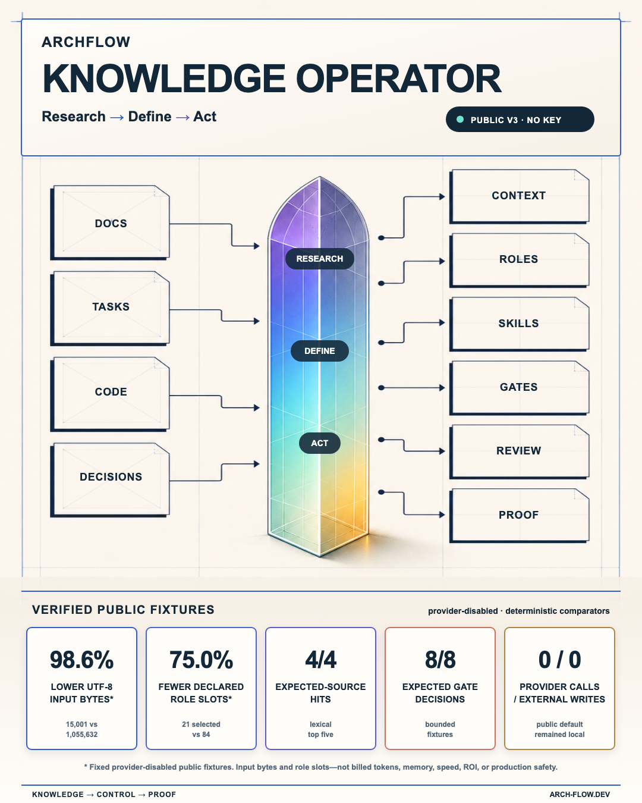

# ArchFlow Knowledge Operator

ArchFlow is a local-first operating kit for turning a bounded objective and approved evidence into an inspectable plan, a role-safe execution path, independent review, and maintained knowledge. It gives an individual operator or a small team one shared structure for research, definition, action, validation, handoff, and learning—without treating a convincing model response as proof that work happened.

The practical problem is rarely “we cannot generate enough text.” It is that the evidence, decision, ownership, execution state, review, and memory are spread across chats and tools. Context has to be reconstructed. Agent roles sound impressive but do not own a precise output. Integrations are activated before their data and budget boundaries are clear. Old project history accumulates faster than useful knowledge.

ArchFlow addresses that operating gap. Its public core works without an API key and keeps every important transition visible. Optional authentication, model providers, observability, deployment, and external writeback are separate server-side extensions with their own proof, budget, approval, rollback, and readback gates.



## What It Is For

Use ArchFlow when a task needs more than a one-off answer:

- research has to stay tied to an exact source boundary;
- a decision needs facts, interpretations, hypotheses, and gaps kept separate;
- multiple people or agents need one owner per output and non-overlapping work scopes;
- model, tool, budget, and write permissions must be explicit;
- progress has to be reconstructed from state and evidence rather than chat confidence;
- a maker’s output needs deterministic checks and an independent reviewer;
- an external action needs exact approval, rollback, replay protection, and readback;
- useful lessons should survive the run without retaining raw personal or project context.

The tool is deliberately generic. The repository contains portable skills, functional roles, schemas, defaults, validators, public examples, and documentation. It does not contain the creator’s personal memory, client data, private URLs, local machine paths, raw transcripts, deployment identifiers, or credentials.

## The Operating Loop

One case moves through five understandable stages:

1. **Research** — admit a bounded source set, retrieve task-specific evidence, verify exact passages, and keep provenance and gaps visible.
2. **Define** — state the decision, acceptance criteria, authority, role and skill bindings, expected outputs, reviewer, retry cap, and stop conditions.
3. **Act** — run the smallest responsible path. Authentication can identify an administrator, but provider calls, Git, deployment, spend, and writeback remain separate approvals.
4. **Review** — freeze the candidate, run deterministic checks, and require an independent approve, revise, or block verdict.
5. **Remember** — promote only reusable meaning with source lineage, ownership, freshness, and supersession. Raw conversation exhaust stays out.

LangGraph is the state-owner contract. Functional roles are bounded workers. LlamaIndex supplies allowlisted retrieval with lexical fallback and source paths. CrewAI may materialize a reviewed role/task subset but does not become the canonical state machine. The dashboard and Jarvis are browser surfaces; they prepare and display packets rather than silently executing them.

## Dashboard

Run the local server and open `http://127.0.0.1:8765/project/dashboard/`.

The restored Knowledge Operator has five primary destinations:

- **Documentation** explains the product, the pain it removes, the operating loop, the four schemas, and the public boundary.
- **Project** prepares one bounded case: objective, decision, approved evidence, exclusions, requested output, reviewer, and stop conditions.
- **Roles & Skills** shows the 21 functional responsibility contracts, four smallest-responsible role packs, and ten portable public skills.
- **Setup** separates the zero-key static core, validated local runtime, and gated server-side integrations.
- **Evidence** publishes exact comparators, proof states, limitations, review gates, and receipts.

Four secondary technical routes keep deeper material available without making it the first thing a new user sees: **Four Schemas**, **Knowledge & Memory**, **Research → Define → Act**, and **Configuration**. The **Communication Center** is intentionally absent from primary navigation; Project and Jarvis open it when a packet needs review, and it can also be opened directly to inspect its empty state.

The dashboard can also open directly from `project/dashboard/index.html`. A generated `data.js` fallback prevents the direct-file failure that browsers cause when they block local JSON fetches. All public navigation is protocol-aware; no link can resolve to the local filesystem root.

## Jarvis And The Communication Center

Jarvis is a focused work-packet composer, not an execution runtime or a separate source of truth. It accepts public-safe text fields, validates a versioned handoff, stores it only in the current tab’s session storage, and returns to the dashboard **Communication Center**. Packet content never enters the URL and is never sent automatically.

The Communication Center shows:

- the incoming objective and decision;
- allowed and excluded evidence;
- the expected output, reviewer, and stop conditions;
- local notifications and state changes;
- provider-call and external-write counters;
- the next safe action or the exact reason to stop.

Downloads are review proposals. They do not create files, start agents, commit code, deploy, or write to a database.

## Four Architecture Schemas

The four SVGs are both a complete gallery and distributed explanations inside the dashboard:

| Schema | Dashboard placement | What it explains |
|---|---|---|
| [Seven-layer knowledge crew](project/assets/architecture/knowledge-crew-tower.svg) | System map | Which layer receives the work, what it owns, and which accountable output moves forward |
| [Input and perception flow](project/assets/architecture/context-input-flow.svg) | Knowledge & Memory | How rules, responsibility, requirements, retrieved evidence, exact reads, and gaps become one context capsule |
| [Output, validation, and receipts](project/assets/architecture/output-receipt-flow.svg) | Evidence | How a candidate passes requirement, authority, maker-check, independent-review, action, readback, and promotion gates |
| [Onboarding and teamwork](project/assets/architecture/onboarding-teamwork-flow.svg) | Roles & Communication | Who joins, what they own, how handoffs work, and when the system must interrupt or escalate |

Every labeled role is functional. The diagrams contain no personal call names. Configuration numbers shown inside a schema are defaults or bounded examples—not universal performance claims.

## Verified Fixture Metrics

The current V3 benchmark uses four fixed public synthetic tasks and deliberately simple comparators. It made zero provider calls and zero external writes.

| Measure | Result | Exact comparator | Limitation |
|---|---:|---|---|
| Context input | **98.6% lower** | Top-five lexical context chunks versus four full-manifest packets: 15,001 vs 1,055,632 UTF-8 bytes | Input bytes, not model-exact tokens, billed tokens, durable-memory size, latency, or answer quality |
| Role activation | **75.0% fewer** | Smallest declared role packs versus all-role fan-out: 21 vs 84 role slots | Contract selection, not wall-clock speed, labor saved, or throughput |
| Expected source recall | **4 / 4** | Expected canonical source appears in deterministic lexical top five | Source-hit fixture, not semantic answer accuracy or representative production recall |
| Semantic gates | **8 / 8** | One valid and seven unsafe or incomplete packets match expected accept/reject decisions | Bounded abuse fixtures, not a real-world safety rate |

Reproduce the measurements:

```bash
python3 project/scripts/benchmark-actionable-agents.py
python3 project/scripts/generate-dashboard-data.py
python3 project/scripts/validate-dashboard-data.py
```

The machine-readable fixture and result live in `project/benchmarks/`. Rerun them whenever the manifest, roles, fixtures, or selection logic changes. Do not describe these numbers as “memory saved,” billed-token savings, faster delivery, ROI, production accuracy, or universal safety.

## Three-Minute Zero-Key Setup

Prerequisites: Git and Python 3.11 or later. Node.js is useful for the optional JavaScript syntax check.

```bash
git clone https://github.com/mcharniuk1-spec/archflow_b1_knowledge.git archflow
cd archflow
python3 project/scripts/generate-dashboard-data.py
python3 project/scripts/validate-dashboard-data.py
python3 -m http.server 8765
```

Open:

- `http://127.0.0.1:8765/project/dashboard/` — Knowledge Operator;
- `http://127.0.0.1:8765/jarvis.html` — public-safe packet composer.

The default path does not inspect environment values, start a model, send data, create a repository change, or write externally.

## Individual And Team Use

The architecture is the same in both modes. An individual can coordinate several role contracts, but high-risk maker and reviewer responsibilities remain separate. Browser drafts stay local and can be exported for review.

A team assigns the same functional role IDs to people or compatible runtimes, keeps one writer per shared target, and uses:

`bounded contract → maker candidate → deterministic checks → independent review → approved action → readback → maintained knowledge`

The public browser is not shared collaboration. Hosted tenancy, RBAC, shared persistence, retention, backup, and recovery require separate proof.

## Administrator Authentication

The public UI has no client-selectable Admin/Guest mode and no pasted owner-token field. **Admin access** starts a server-enforced Google OpenID Connect flow with state, nonce, PKCE, verified ID-token validation, a server-side allowlist, a short-lived signed cookie, same-origin checks, CSRF protection, and logout cookie clearing. Because sessions are stateless, they cannot be individually revoked before expiry; changing `ARCHFLOW_AUTH_SESSION_EPOCH` or rotating the signing key invalidates all issued sessions, while individual revocation requires a server-side session store.

Only environment-variable names are documented:

```text
ARCHFLOW_AUTH_ENABLED
GOOGLE_OAUTH_CLIENT_ID
GOOGLE_OAUTH_CLIENT_SECRET
ARCHFLOW_AUTH_ORIGIN
ARCHFLOW_AUTH_SECRET
ARCHFLOW_AUTH_SESSION_EPOCH
ARCHFLOW_ADMIN_GOOGLE_SUBJECTS
ARCHFLOW_ADMIN_EMAILS
ARCHFLOW_AUTH_SESSION_TTL_SECONDS
```

Allowlist values and account identities stay outside Git and public responses. Missing configuration fails closed. A verified administrator session still does not approve a model call, spend, Git mutation, deployment, publication, or external write.

## Optional Runtime And Providers

The canonical provider registry starts at `ARCHFLOW_PROVIDER_MODE=none`:

- **none** — built-in zero-key generation, validation, retrieval, and review packets;
- **Ollama** — optional loopback adapter after endpoint, model, privacy, and fixture checks;
- **OpenRouter** — documented as a possible adapter, with no execution path in the public release;
- **OpenAI, Anthropic, Gemini, and Mistral** — documented direct-adapter plans, not claimed implementations;
- **LangSmith** — optional observability, never a model provider, and off by default.

Credential values and even credential-presence signals must never appear in public health, generated data, browser state, exports, logs, or screenshots.

## Repository Map

| Path | Purpose |
|---|---|
| `project/dashboard/` | Responsive Knowledge Operator UI, exact corpus manifest, and generated public projection |
| `jarvis.html`, `jarvis.css`, `jarvis.js` | Public-safe packet composer and Communication Center handoff |
| `api/auth/` and `api/_auth_contract.py` | Fail-closed Google administrator session boundary |
| `project/agents/` | Functional role roster, role/skill mapping, and smallest-responsible role packs |
| `skills/` | Portable public operating contracts |
| `project/workflows/` | LangGraph, CrewAI, LlamaIndex, and knowledge-integration contracts |
| `project/database/` | Run, event, review, receipt, memory, role, and skill schemas/catalogs |
| `project/config/provider-registry.json` | Canonical provider states and server-side activation requirements |
| `project/benchmarks/` | Fixed fixtures, exact denominators, raw results, and limitations |
| `project/scripts/` | Setup, generation, validation, retrieval, authentication, benchmark, and browser checks |

Historical project runs, private workspace memory, live coordination logs, generated graph dumps, and release-recovery data are not part of the public product snapshot.

## Honest Boundary

The public release proves a responsive documentation and packet-preparation system, a generic actionable-role structure, bounded retrieval fixtures, semantic gates, server-side authentication contracts, and provider-disabled checks. It does not claim fully autonomous operation, production availability, customer ROI, live provider execution, continuous monitoring, shared multi-user state, or automatic external writeback.

Read [Quickstart](docs/quickstart.md), [Dashboard operating manual](docs/dashboard-operating-manual.md), [Unified architecture](docs/unified-operating-architecture.md), [Security and data boundaries](docs/security-and-data-boundaries.md), and [Security reporting](SECURITY.md) next.

## License

ArchFlow Knowledge Operator is available under the [MIT License](LICENSE).
