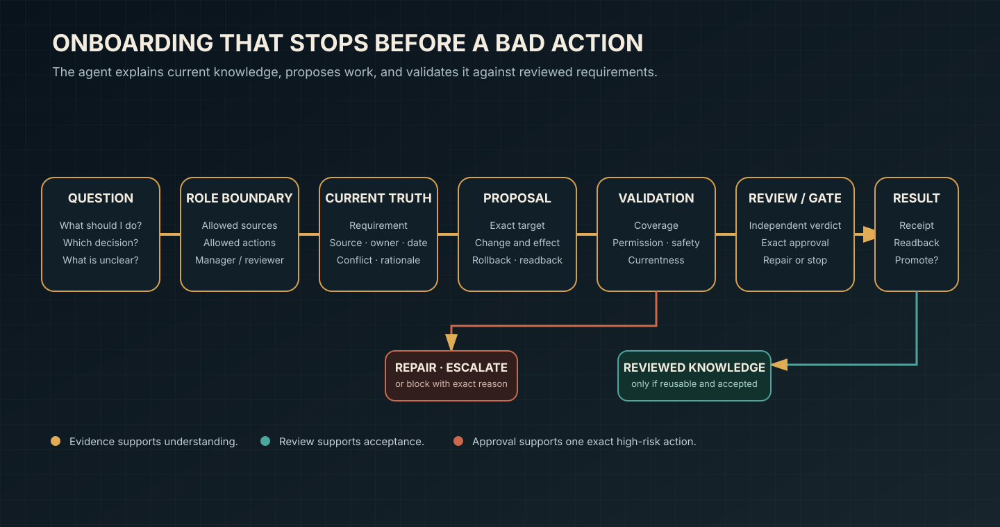

# Employee Onboarding Knowledge Agent

Status: public contract and synthetic fixture
Last verified: 2026-08-05
Execution default: provider-disabled and writeback-disabled

The onboarding agent helps a new employee understand current company knowledge, propose the smallest useful next action, and validate that action against reviewed requirements before work begins.

## Interaction contract

1. Bind the employee to an approved role, manager/reviewer, task, corpus, and allowed actions.
2. Retrieve only the current requirement, decision, rationale, owner, freshness, contradiction, and source fields needed for the question.
3. Answer with visible status: fact, interpretation, hypothesis, or gap.
4. Convert “What should I do?” into an action proposal, not an automatic instruction.
5. Validate requirement coverage, decision currentness, role authority, source boundary, side effects, rollback, review, approval, and readback.
6. Escalate stale knowledge, contradictions, missing authority, or manager decisions.
7. Record accepted outcomes and promote only future-useful reviewed knowledge.



## What the employee sees

- the current requirement and why it exists;
- who owns and reviewed it;
- the source and freshness state;
- contradictions and gaps that affect the task;
- allowed and forbidden actions for the role;
- a proposed first task with acceptance and readback;
- whether the proposal is eligible, needs repair/approval, or is blocked.

The agent does not imitate a former employee, monitor workers, hide uncertainty, infer broader permission from source access, or convert a single successful task into company policy.

## Requirements validation

Every proposed effect must link to an approved current requirement or a declared incident/maintenance exception. The proposal must also specify exact target, human-reviewable change, decision references, side effects, reversibility, rollback, preflight, postcondition, readback, reviewer, and approval class.

An external communication, deployment, private-data provider call, production promotion, destructive action, credential write, or live memory writeback waits for target-specific owner approval even if the tool is connected.

## Try the safe fixture

```bash
python3 project/system/validate_system.py
```

Expected result: one proposal is `eligible`; stale, unknown-authority, target-escape, and reviewer-spoof proposals are `blocked`; malformed packets are rejected before execution. Nothing is executed.

## Adaptation checklist

- Replace only the synthetic source manifest, never the validation rules first.
- Define role scope and a different reviewer for material work.
- Create stable requirement IDs and mark historical records `superseded` rather than deleting them.
- Add an adversarial stale or contradictory case before adding a live connector.
- Keep private sources behind a local allowlist and return sanitized evidence references.
- Prove readback and rollback before enabling any write adapter.
