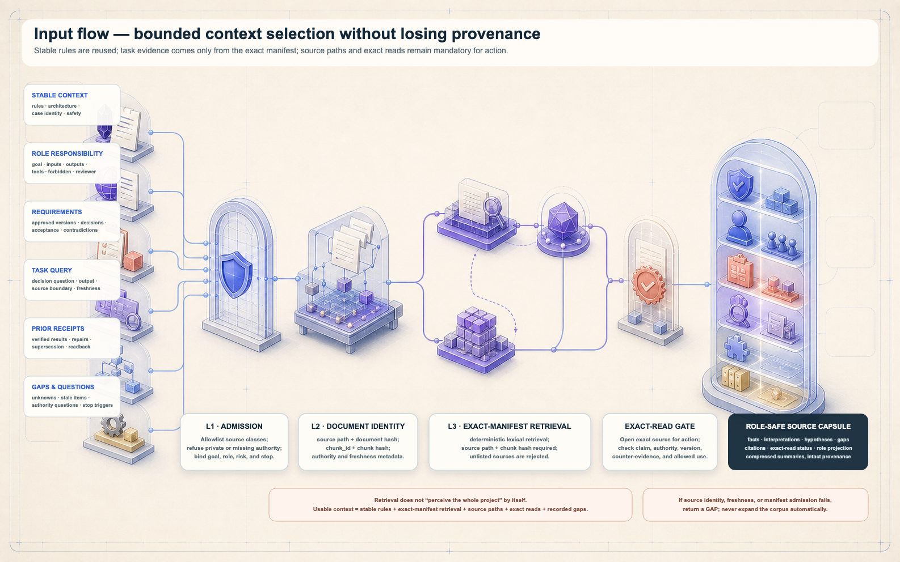
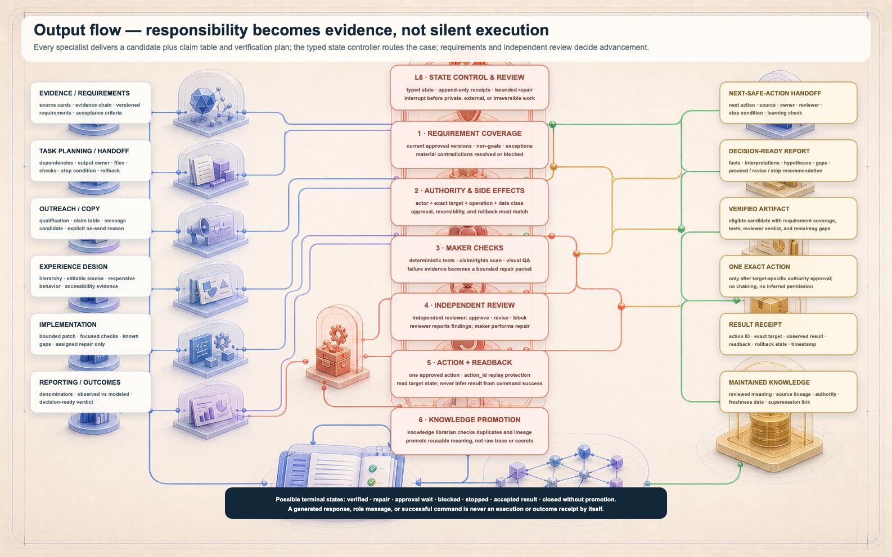
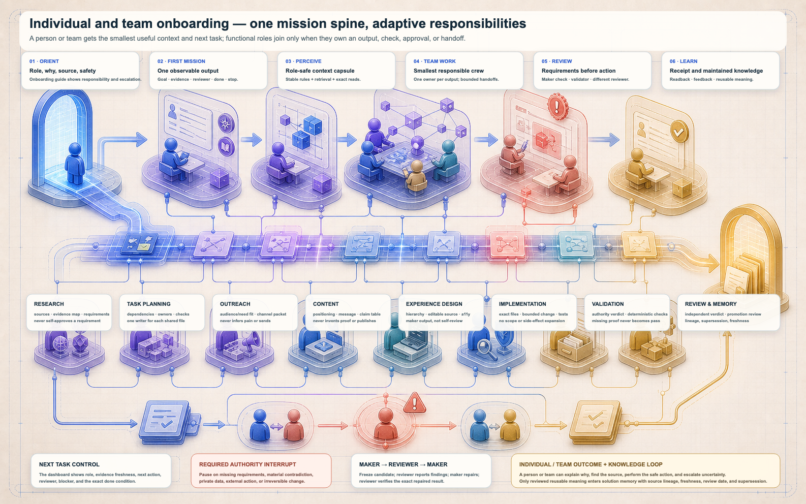

# Responsive Knowledge Crew Architecture

Status: canonical public architecture
Version: 3.0
Canonical contracts: `project/system/contracts/`

ArchFlow is a local-first operating kit for work that crosses research, decisions, implementation, review, and maintained knowledge. It gives an individual or a small team one visible case instead of a chain of disconnected chats. The case records the objective, approved sources, decisions, role ownership, state transitions, candidate artifacts, review verdicts, action receipts, and the next safe step.

The public repository is deliberately generic. It includes reusable schemas, role contracts, workflows, skills, fixtures, and a browser dashboard. It does not include a creator workspace, personal memory, customer material, credentials, deployment values, or a live provider connection.

*The seven-layer view explains where authority, evidence, context, role work, validation, receipts, and maintained knowledge belong. The [editable SVG](../project/assets/architecture/knowledge-crew-tower.svg) contains the same labels at full resolution.*

## The problem it solves

AI-assisted work usually breaks at the joins. A useful source is found, but its authority or freshness is unclear. A draft is produced, but nobody owns the decision. A task is marked complete, but there is no exact artifact or readback. Chat history grows, while the reusable conclusion becomes harder to recover. Adding more agents makes this worse when every role sees everything and no role has a bounded output.

ArchFlow treats those joins as the product. It keeps five questions visible throughout a case:

1. What decision or outcome is this work meant to support?
2. Which exact sources and constraints are allowed?
3. Which role owns each output, and who reviews it?
4. What evidence proves the action or artifact is complete?
5. What should be remembered, superseded, or left as a gap?

The operating invariant is simple:

> A source, model, tool, role, or successful command may contribute evidence. None of them silently creates authority, approval, or a verified result.

## One case, seven traced states

The browser experience presents a human-friendly **Research → Define → Act** loop. Underneath, the controller uses seven explicit states:

| Experience | Controller state | Required result before moving on |
|---|---|---|
| Research | `frame` | Objective, decision, authority, risks, done conditions, and stop rules |
| Research | `ground` | Exact source boundary, source-linked context, contradictions, and gaps |
| Define | `design` | Role pack, one owner per output, checks, reviewer, attempts, and handoffs |
| Act | `execute` | Frozen candidate or separately approved action proposal |
| Act | `verify` | Deterministic checks, exact readback, and independent verdict |
| Act | `remember` | Promotion, supersession, freshness, or no-memory decision |
| Handoff | `handoff` | Artifact, evidence, remaining gaps, and next safe action |

Every transition has a gate. Failed checks return a bounded repair route; repeated failure without new evidence stops the case. Provider calls and external writeback remain disabled unless a separate target-specific approval and runtime proof exists.

## Seven connected knowledge layers

### L1 — Case authority and scope

The case begins with a bounded objective, the decision it must support, observable done conditions, allowed operations, risk, exact exclusions, and a reviewer. If the evidence boundary or authority is unclear, the correct result is a named gap—not broad ingestion or a guess.

### L2 — Approved source spine

The source spine is an exact allowlist. Each admitted item retains a repository-relative path, identity, content hash, and source status. Unlisted project history, conversations, personal context, credentials, private URLs, raw uploads, and generated deployment state remain outside the public corpus.

### L3 — Bounded context perception

*The context schema shows how stable rules and task evidence become a source-visible working capsule. See the [editable SVG](../project/assets/architecture/context-input-flow.svg).*

Context is assembled in a cascade:

1. Stable case rules and role responsibility are loaded first.
2. Only files listed in the exact corpus manifest are eligible for retrieval.
3. Deterministic lexical ranking selects a small source-linked candidate set.
4. Material claims are checked against exact source text.
5. Contradictions, freshness concerns, and missing evidence remain visible.
6. The final capsule contains only what the selected role needs.

The default public path is standard-library and provider-disabled. LlamaIndex may wrap the same manifest and provenance contract in an optional local runtime. Embedding or vector adapters are separate extensions and cannot change source authority.

### L4 — Adaptive role crew

The canonical catalog contains 21 functional roles, but a case does not activate all of them. It selects the smallest declared role pack that owns the required outputs, checks, review, and handoff.

The public baseline contains four packs:

| Pack | When to use it | Owned result |
|---|---|---|
| Research to decision | A decision needs bounded evidence and explicit gaps | Source-linked research receipt |
| Definition to task graph | A goal needs roles, dependencies, checks, and stop rules | Bounded task and handoff graph |
| Responsive product change | A reviewed requirement must become a tested artifact | Candidate, browser or deterministic evidence, verdict, and release handoff |
| Reviewed memory update | A result may be reusable in a later case | Solution or action-memory decision with lineage |

A role contract defines responsibility and a capability ceiling. Effective authority is always the intersection of case authority, the role ceiling, available runtime capabilities, exact targets, and explicit denials. The maker and high-risk reviewer must be different roles.

CrewAI is an optional materialization of these role and task contracts. In the public baseline it is contract-only: planning, delegation, provider execution, and framework memory are off.

### L5 — Specialist research and delivery

Specialist roles create reviewable candidates: a source report, requirement packet, task graph, design, implementation, copy draft, verification packet, or memory candidate. They do not approve their own high-risk work and do not turn a draft into an external action.

Ten portable skill packages provide reusable procedures for coordination, architecture, bounded research, task design, runtime checks, natural writing, critical questions, priority selection, and handoff. Plain method capabilities remain methods; they are not presented as additional installed skills.

### L6 — State control, validation, and review

*The output schema separates a candidate from a verified result, and a verified result from a reviewed memory update. See the [editable SVG](../project/assets/architecture/output-receipt-flow.svg).*

Validation proceeds in a fixed order:

1. required fields and approved-source coverage;
2. actor, operation, exact target, and data class;
3. side effects, reversibility, rollback, and idempotency;
4. deterministic maker checks;
5. independent reviewer verdict;
6. separate owner approval when an external effect is required;
7. one bounded action;
8. exact post-action readback.

LangGraph can materialize the canonical state transitions, conditional routes, interrupts, attempt caps, and recovery behavior. The public smoke is provider-disabled and uses synthetic fixtures. Persistent checkpoints are an optional runtime concern, not a requirement for the static tool.

### L7 — Receipts, outcomes, and maintained knowledge

A command exit code is evidence, not the whole result. A complete handoff names the exact artifact, checks, verdict, observed state, remaining gaps, and next safe action.

ArchFlow separates two reusable memory types:

- **Solution memory** records a reviewed conclusion, the situation where it applies, source lineage, freshness, reuse limits, and supersession.
- **Action memory** records what was actually attempted, the approved target, observed result, verification, rollback state, and readback.

Raw conversation history is not automatically promoted. A memory candidate is accepted only when it is reusable, source-linked, independently reviewed, assigned an owner or review condition, and safe for the selected boundary.

## Individual and team operation

*The fourth schema shows how one person can run the complete loop, while a team can distribute bounded outputs without losing one shared case. See the [editable SVG](../project/assets/architecture/onboarding-teamwork-flow.svg).*

For an individual, one operator can hold several maker roles sequentially, but should still freeze the candidate and use an independent review step for high-risk work. Browser drafts stay local until exported intentionally.

For a team, each artifact has one writer, one named handoff target, and one review route. Parallel work is capped and allowed only when outputs and files do not overlap. The shared object is the case envelope and its receipts—not an unrestricted shared chat transcript.

## Dashboard distribution

The restored Knowledge Operator keeps the architecture usable rather than turning it into a documentation maze:

| View | Job |
|---|---|
| Documentation | Explain the problem, loop, boundaries, and four schemas |
| Project | Prepare one bounded case and export a review packet |
| Roles & Skills | Inspect the 21 responsibility contracts, four packs, and ten portable skills |
| Setup | Separate the zero-key core from optional authenticated or provider-backed extensions |
| Evidence | Show exact comparators, fixtures, limitations, checks, and review state |
| Communication Center | Hidden from primary navigation; receive one validated Project or Jarvis packet in the same tab, remove it from transit storage, or show an empty state |

The four secondary technical routes are **Four Schemas**, **Knowledge & Memory**, **Research → Define → Act**, and **Configuration**. Jarvis is a browser handoff entry point, not a second architecture. It prepares a public-safe work packet and hands it to the dashboard Communication Center. It does not place packet content in the URL, choose an administrator identity, call a provider, or execute the request.

## Setup layers

The dashboard presents three progressive setup tiers:

1. **Static public core:** documentation, dashboard, case composer, roles, schemas, local exports, and deterministic checks; no keys are required.
2. **Validated local runtime:** isolated validation, agentic, or Jarvis profiles may add dependency-backed checks while providers, network actions, and external writes remain disabled.
3. **Gated server integrations:** Google administrator authentication, provider or observability adapters, databases, deployment, and writeback are independent additions. Each must pass its own configuration, data-boundary, negative-test, budget/effect, approval, rollback, and readback gates.

No UI field accepts a provider key or owner token. Missing authentication configuration fails closed. Authentication itself does not approve provider use, spend, Git mutation, deployment, publication, or writeback.

## Verification boundary

The public release is checked with deterministic JSON/YAML validation, role and skill closure, accepted and rejected state fixtures, exact-manifest retrieval, provider-disabled benchmark fixtures, API abuse cases, JavaScript syntax checks, direct-file and HTTP routing, storage reset behavior, and responsive browser tests at five widths.

Published percentages must name their comparator and denominator. The benchmark measures UTF-8 input bytes and declared role slots on fixed synthetic tasks; it does not measure durable memory deleted, model-exact or billed tokens, wall-clock speed, labor saved, customer return, answer quality, or universal safety.

## Canonical files

- `project/system/contracts/operating-model.json`
- `project/system/contracts/knowledge-crew-config.json`
- `project/system/contracts/role-catalog.json`
- `project/agents/actionable-role-packs.json`
- `project/database/run-envelope.schema.json`
- `project/database/solution-memory-record.schema.json`
- `project/database/action-receipt.schema.json`
- `project/dashboard/corpus-manifest.json`
- `project/workflows/langgraph-controller.yaml`
- `project/workflows/crewai-crew.yaml`
- `project/workflows/llamaindex-rag.yaml`

Together these files define a portable operating structure: admit a bounded case, ground it in exact sources, select the smallest responsible crew, trace execution, verify the result, and remember only what remains useful.
