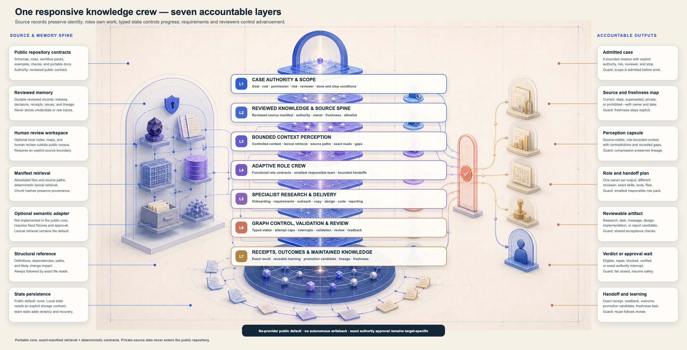

# Unified Operating Architecture

ArchFlow uses one Knowledge Case Controller across research, planning, delivery, review, and maintained knowledge. The public repository contains generic contracts and synthetic examples only. It carries no creator workspace, personal project memory, customer data, credentials, or provider state.

The detailed reference is [Responsive Knowledge Crew Architecture](responsive-knowledge-crew-architecture.md).

## Research, Define, Act

The simple product loop maps to seven explicit states:

- **Research:** `frame` the objective and authority, then `ground` it in approved sources.
- **Define:** `design` the smallest role pack, outputs, checks, reviewer, attempts, and stops.
- **Act:** `execute` a bounded candidate, `verify` it independently, and `remember` only reviewed reusable meaning.
- **Handoff:** deliver the artifact, evidence, gaps, and next safe action.

## Seven connected layers

1. Case authority and scope.
2. Approved source spine.
3. Bounded context perception.
4. Adaptive role crew.
5. Specialist research and delivery.
6. State control, validation, and review.
7. Receipts, outcomes, and maintained knowledge.

## Runtime boundaries

- The standard-library core reads an exact public manifest and uses deterministic lexical retrieval.
- LlamaIndex can wrap the same retrieval contract locally; it does not become durable memory or source authority.
- CrewAI can materialize selected role/task contracts; public planning, delegation, provider execution, and framework memory stay off.
- LangGraph can materialize typed states, routes, interrupts, attempt caps, and recovery; public fixtures remain provider-disabled.
- Jarvis only composes a browser-local packet and transfers it to the dashboard Communication Center without putting content in the URL.
- Google authentication is server-enforced. A verified administrator session does not imply approval for a provider call, spend, Git action, deployment, publication, or writeback.

## Dashboard distribution

The Knowledge Operator has five primary destinations: **Documentation**, **Project**, **Roles & Skills**, **Setup**, and **Evidence**. Its four secondary routes are **Four Schemas**, **Knowledge & Memory**, **Research → Define → Act**, and **Configuration**. **Communication Center** is hidden from primary navigation, opens from Project or Jarvis, and can show either a validated packet or an honest empty state. The four restored generic schemas explain the seven layers, bounded context, output verification, and individual/team handoff.

## Canonical contracts

- `project/system/contracts/operating-model.json`
- `project/system/contracts/knowledge-crew-config.json`
- `project/system/contracts/role-catalog.json`
- `project/agents/actionable-role-packs.json`
- `project/system/schemas/knowledge-case.schema.json`
- `project/system/schemas/role-task-binding.schema.json`
- `project/system/schemas/action-proposal.schema.json`

Run `python3 project/system/validate_system.py` for the provider-disabled contract proof. Exact performance fixtures and their limitations are documented in [Performance Evidence](performance-evidence.md).
