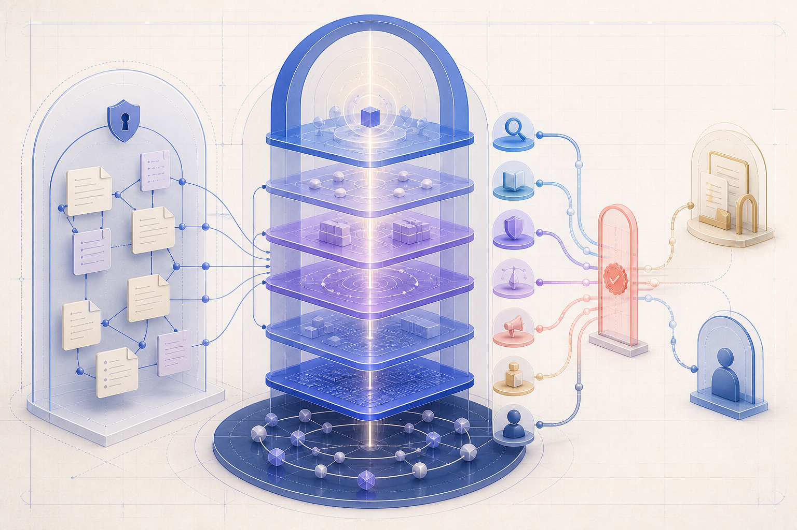
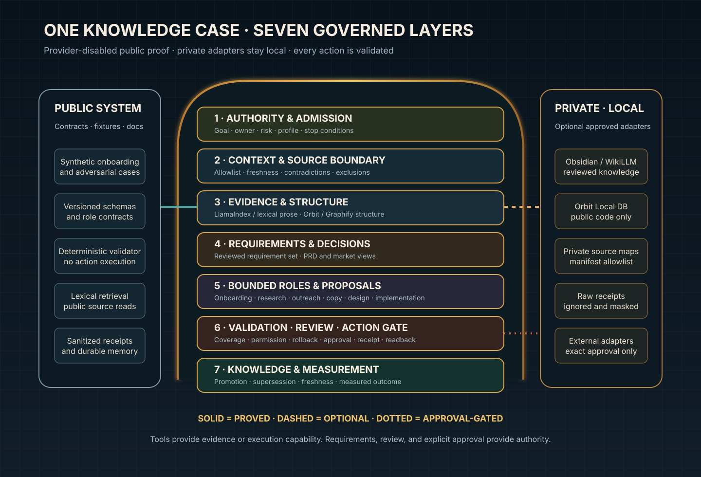

# Unified Operating Architecture

Status: implemented and independently approved
Authority: current ArchFlow knowledge-reliability strategy and the 2026-08-05 architecture admission
Last verified: 2026-08-05
Supersedes: `Architecture 1` and `Architecture 2` as top-level system concepts
Does not supersede: historical run evidence or compatibility packet formats

## One controller, one case, many bounded roles

ArchFlow is a governed knowledge-case system for employee onboarding and reliable work. Every question, proposed task, creative, outreach packet, implementation, or correction uses the same evidence and requirement spine.



*Conceptual art only. The editable SVG below is the canonical system diagram.*

```text
request
  -> admission and authority
  -> bounded context and evidence
  -> evidence reconciliation
  -> reviewed requirements and decisions
  -> role-safe answer or candidate work
  -> requirement/action validation
  -> approval when the exact action requires it
  -> execution receipt and readback
  -> independent acceptance
  -> selective knowledge promotion
```

The former PRD/ICP lane is now `requirements_and_market_research`, one role inside this route. It can prepare a PRD, ICP, market report, decision brief, onboarding map, or acceptance checklist as a projection of reviewed requirements. It cannot approve requirements, infer demand, execute work, or promote its own result.

## Seven layers

1. **Authority and admission** — owner, goal, profile, constraints, approval class, and stop conditions.
2. **Context and source boundary** — approved corpus, current/superseded status, owner, freshness, and exclusions.
3. **Evidence and structure** — lexical/LlamaIndex prose retrieval plus Orbit/Graphify structural evidence.
4. **Requirements and decisions** — reconciled problem, market, acceptance, non-goal, contradiction, and decision records.
5. **Bounded roles and proposals** — onboarding, research, planning, copy, outreach, design, implementation, or other candidate work.
6. **Validation, review, and action gate** — requirement coverage, permission, effects, rollback, independent review, exact approval, receipt, and readback.
7. **Knowledge and measurement** — reviewed promotion or supersession, freshness trigger, operational metrics, and safe handoff.



## Knowledge Case Controller

The public contract exposes five behavioral operations:

| Operation | Result | Does not do |
|---|---|---|
| `open_case` | admitted or blocked case | retrieve or write |
| `advance_case` | next state, required role, missing evidence | expand authority |
| `evaluate_proposal` | eligible, approval-needed, repair, stale, conflict, or blocked verdict | execute |
| `record_result` | verified, repair, failed, or blocked result | infer success from a command |
| `propose_promotion` | reviewed public/private/role projection candidate or no-promotion | copy raw traces into memory |

All roles receive a least-privilege projection of the same case. A tool connection is never proof of permission or business correctness.

## Role execution trace

The normalized catalog preserves how ArchFlow work was actually delivered:

- Requirements and market research combines the earlier discovery, PRD, ICP, market, economics, and pain-evidence functions under one reviewed output contract.
- Qualification and channel planning verifies identity, stage, current role, and evidence before a message candidate; it never sends.
- Positioning and copy turns approved pain evidence into a bounded mechanism and low-pressure question without inventing proof.
- Designer owns the visual brief, scene/interface grammar, editable artifact, accessibility/layout evidence, and recoverable maker output. Claim approval and publication remain separate.
- Implementation makers change only claimed files or exact external targets after gates pass.
- Independent reviewers issue `APPROVE`, `REVISE`, or `BLOCK` against frozen maker output; they do not silently repair it.
- Knowledge librarians promote only accepted reusable conclusions with lineage, owner, freshness, contradiction, and supersession data.
- Integrators coordinate lanes, shared surfaces, receipts, validation, and handoff without gaining self-approval.

The complete machine-readable authority map is in `project/system/contracts/role-catalog.json`.
The [executed role and knowledge trace](executed-role-and-knowledge-trace.md) shows how market/pain research, qualification, outreach, publication creative, design, review, integration, and knowledge promotion produced this catalog.

## Public/private boundary

The public repository contains contracts, synthetic fixtures, deterministic validation, diagrams, and sanitized run evidence. A private installation may contain approved confidential sources, local indexes, binaries, runtime receipts, absolute paths, and private knowledge adapters.

Only independently reviewed, masked conclusions cross from private to public. Raw private text, vault paths, Orbit databases, full source mirrors, credentials, logs, account identifiers, and deployment metadata never cross.

## Evidence tools

| Component | Valid job | Not authority for |
|---|---|---|
| Orbit Local | current code definitions, imports, references, structural impact | requirements, business truth, approval, durable memory |
| Graphify | generated structure and relationship reference | final synthesis |
| LlamaIndex/lexical | allowlisted prose and exact-source retrieval | durable truth or source permission |
| Obsidian/WikiLLM | reviewed decisions, requirements, ownership, freshness, contradictions | raw runtime traces or broad ingestion |
| LangGraph | state, transitions, interrupts, repair limits | knowledge truth or edits |
| Codex | scoped execution, integration, checks, promotion under approval | silent deployment, provider, or external authority |

## Proof status

The public validator checks and applies the supported schema contracts, cross-checks roles and states, accepts one bounded documentation proposal, blocks stale/unknown-authority, parent-traversing target, and reviewer-spoof proposals, and rejects malformed packets. It does not prove a live model, live vault, hosted system, autonomous agent, or dashboard migration.
