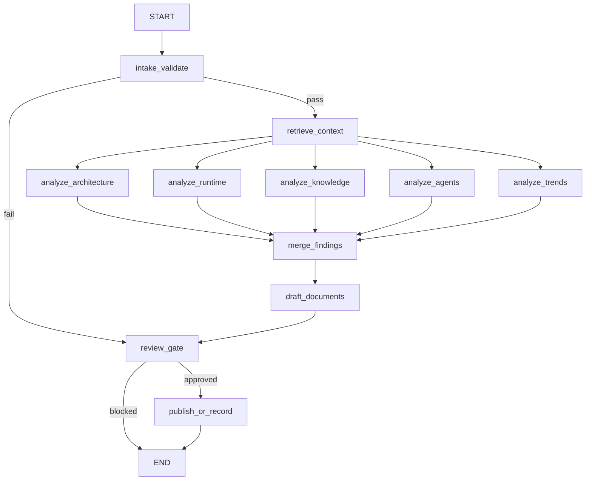

# E1.2 PRD - Dialogue-To-PRD Full Test

Date: 2026-06-26
Status: approved internal public-safe proof
Owner roles: AF Manager with AF Tools, AF Context, AF Knowledge, AF Review, and AF Publisher

## Product

ArchFlow Block 1 Dialogue-to-PRD Knowledge Engine.

## Problem

Strategic conversations and setup runs produce useful execution knowledge, but the material is easy to lose, repeat, or publish unsafely. ArchFlow needs a reproducible internal workflow that converts a sanitized source packet into PRD, task division, knowledge-base updates, review evidence, and a handout for the next agent.

## Goal

Complete one full E1.2 proof package that demonstrates:

- public-safe source intake;
- approved-corpus retrieval;
- LangGraph-controlled parallel and sequential workflow stages;
- role-based CrewAI-style task division;
- PRD, streaming report, and system report generation;
- WikiLLM writeback;
- public-safety and runtime validation;
- Git commit and push readiness.

## Users

| User | Need |
|---|---|
| Founder/operator | Convert messy planning context into execution assets without repeating discovery. |
| Product manager | Get a PRD, task matrix, acceptance criteria, and risks from a controlled workflow. |
| Agent operator | Know which role owns each stage and how to continue without chat history. |
| Reviewer | Verify public-safety, evidence quality, runtime status, and unresolved gaps. |

## Non-Goals

- Do not ingest raw private transcripts, private Notion pages, private workspace links, screenshots, or credentials.
- Do not claim customer validation, ROI, or paying demand.
- Do not activate live Nexus writes.
- Do not promote Obsidian mirror to source of truth before the vault target is verified.
- Do not treat CrewAI LLM task execution as complete until it runs inside a LangGraph-reviewed proof.

## Source Boundary

The E1.2 proof uses a sanitized source packet and public project files only.

| Allowed | Blocked |
|---|---|
| `project/`, `history/`, `skills/`, `wiki/`, and `graphify-out/GRAPH_REPORT.md` | Raw private source material, secrets, private URLs, operational IDs, and local absolute paths |

## Workflow

## Functional Requirements

| ID | Requirement | Owner | Acceptance |
|---|---|---|---|
| FR1 | Validate sanitized source boundary. | AF Tools | Boundary status is `pass` or output is blocked. |
| FR2 | Retrieve approved public context. | AF Context | Source paths are present and private-source refusal remains active. |
| FR3 | Run parallel expert analysis. | LangGraph plus role agents | Architecture, runtime, knowledge, agent, and trends branches complete before merge. |
| FR4 | Produce the PRD. | AF Manager | PRD includes goal, scope, workflow, requirements, task division, risks, and acceptance. |
| FR5 | Produce streaming report. | AF Tools plus AF Review | Report stores observable stream updates, not hidden chain-of-thought. |
| FR6 | Produce system report. | AF Architecture plus AF Knowledge | Report reviews runtime, roles, models, temperature, efficiency, KB, Graphify, Nexus, and vault posture. |
| FR7 | Produce task matrix and KB update. | AF Manager and AF Knowledge | E1.2 outputs define E1.3 next steps and durable memory candidates. |
| FR8 | Run publication gate. | AF Review and AF Publisher | Public safety scan and runtime guard pass before commit/push. |

## LangGraph State

| Field | Purpose |
|---|---|
| `run_id` | Stable run identifier. |
| `source_packet_id` | Sanitized source reference. |
| `source_boundary_status` | `pass` or `fail`. |
| `retrieved_context` | Approved source-path grounded context. |
| `architecture_analysis` | Control-path and layer design findings. |
| `runtime_analysis` | Package, smoke, trace, and guard findings. |
| `knowledge_analysis` | WikiLLM, Graphify, Obsidian, and Nexus findings. |
| `agent_analysis` | Role, model, temperature, and accountability findings. |
| `trends_analysis` | Official-doc tendencies and recommended modern practices. |
| `merged_findings` | Integrated conclusions from parallel branches. |
| `approval_status` | `approved`, `revise`, or `blocked`. |
| `stream_notes` | Public-safe node progress summaries. |

## Agentic Role Division

| Agent | Role | Model/Temperature Policy | Current Status |
|---|---|---|---|
| AF Tools | Source, runtime, and tool readiness. | Deterministic, temperature 0.0-0.2. | Used for validation and graph evidence. |
| AF Context | Source digest and FACT/INTERPRETATION/HYPOTHESIS/GAP split. | Low variance, temperature 0.2-0.4. | Used for digest and retrieval framing. |
| AF Manager | PRD, task division, milestones, and acceptance criteria. | Low-to-moderate, temperature 0.2-0.5. | Used for PRD and matrix. |
| AF Knowledge | KB update, memory, insight, issue, and decision candidates. | Low variance, temperature 0.1-0.3. | Used for WikiLLM outputs. |
| AF Review | Safety, evidence, unsupported-claim, and publication gate. | Strict deterministic, temperature 0.0-0.1. | Used for approval criteria. |
| AF Publisher | Git-ready report pack and handout. | Deterministic, temperature 0.0. | Used for final packaging. |
| Technical Tendencies Analyst | Official-doc trend check and config recommendations. | Moderate, temperature 0.3-0.5. | Used for latest-approach review. |

## Task Division

| Task | Owner | Dependency | Output |
|---|---|---|---|
| E1.2.1 Source boundary and inventory | AF Tools | E1.1 runtime ready | `source-inventory.md` |
| E1.2.2 Retrieval and context digest | AF Context | E1.2.1 | `retrieval-log.md`, `context-digest.md` |
| E1.2.3 Full-test graph run | LangGraph controller | E1.2.2 | `e1_2_langgraph_output.json`, `e1_2_stream_events.jsonl` |
| E1.2.4 PRD and role plan | AF Manager | E1.2.3 | `E1.2_PRD.md`, `responsibility-matrix.md` |
| E1.2.5 Streaming report | AF Tools and AF Review | E1.2.3 | `E1.2_Streaming_report.md` |
| E1.2.6 System report | AF Architecture and AF Knowledge | E1.2.3 | `E1.2_System_report.md` |
| E1.2.7 Review and KB writeback | AF Review and AF Knowledge | E1.2.4-E1.2.6 | `review-report.md`, `kb-update.md`, WikiLLM run note |
| E1.2.8 PDF render, validate, commit, push | AF Publisher | E1.2.7 | Three PDFs, commit, remote push |

## Acceptance Criteria

- E1.2 full-test graph runs and reaches approved status.
- The graph saves stream events and final state.
- PRD, streaming report, system report, task matrix, KB update, review report, run summary, and handout exist.
- The three requested PDFs exist and are text-extractable.
- Public files do not contain secrets, private URLs, local absolute paths, or unmasked operational IDs.
- Workflow validation, LangGraph smoke, LlamaIndex retrieval, CrewAI config check, runtime guard, dashboard regeneration, and public safety scan pass.
- Git commit and push complete after validation.

## Risks

| Risk | Mitigation |
|---|---|
| Overstating E1.2 as customer validation. | Label it internal proof only. |
| Saving hidden reasoning as a report. | Store observable stream events and state summaries only. |
| CrewAI treated as full execution proof too early. | Keep CrewAI LLM execution behind LangGraph review. |
| Nexus activated before vault schemas are known. | Keep Nexus planned until schema discovery and vault readiness pass. |
| Dashboard data stales after edits. | Regenerate dashboard data before final validation. |

## Latest Technical Tendencies Checked

Official docs checked on 2026-06-26 support this direction: LangGraph for durable agent workflows, persistence, streaming, and human-in-the-loop control; CrewAI for crews/processes and role/task accountability; LlamaIndex for agentic workflows and RAG over data; and LangSmith for tracing and observability. Sources are listed in the system report.

## Next Execution

E1.3 should write the approved PRD and agent history into the KB, then run a readback test proving another agent can answer from the public memory without re-reading this chat.
