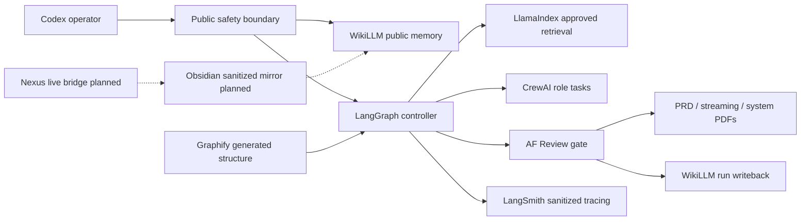

# E1.2 System Report

Date: 2026-06-26
Status: approved internal public-safe system review

## Executive Status

E1.2 confirms that the public ArchFlow Block 1 system is coherent enough for the first full internal proof package. LangGraph controls orchestration. CrewAI defines roles and task ownership. LlamaIndex retrieves approved public context. LangSmith observes sanitized runs. WikiLLM stores durable public memory. Graphify gives generated structure. Obsidian mirror and Nexus remain planned, not active dependencies.

## System Blockschema



## Runtime Stack Review

| Layer | Current State | Efficiency Rating | Risk | Recommendation |
|---|---|---|---|---|
| Codex | Primary operator, editor, verifier, and publication boundary. | High | Human-supervised but reliable. | Keep as primary until full framework execution is proven. |
| LangGraph | Runtime installed; smoke and E1.2 full-test graph passed. | High | No checkpointer yet. | Add persistence before resume/retry/human-interrupt workflows. |
| LlamaIndex | Runtime installed; approved-corpus retrieval works. | Medium-high | Keyword retrieval only. | Add vector retrieval after E1.2/E1.3 corpus stabilizes. |
| CrewAI | Runtime installed; config/import validation passes without LLM execution. | Medium | Full LLM task execution not proven. | Keep sequential and LangGraph-wrapped for first execution. |
| LangSmith | Tracing configured; public files now mask operational ID. | Medium-high | Network/env-dependent. | Trace sanitized runs only; no raw private material. |
| Ollama/Qwythos | Local background model route. | Medium | Local model reliability can vary. | Use for minor/background tasks; Codex remains final reviewer. |
| WikiLLM | Active public memory. | High | Can drift if not updated after runs. | Write run note, log, memory, and insights only when durable. |
| Graphify | Public repo graph exists. | Medium | Generated reference, not human synthesis. | Use for structure navigation and report evidence. |
| Dashboard | Read-only local monitor. | Medium | Snapshot can stale. | Regenerate after workflow changes. |
| Obsidian mirror | Planned sanitized mirror. | Not active | Premature mirror can duplicate raw or stale state. | Mirror only approved public-safe synthesis. |
| Nexus | Planned live vault bridge. | Not active | Schema/runtime uncertainty. | Use only after schema discovery and vault readiness. |

## Graphify Structure Output

| Metric | Value |
|---|---|
| Files | 80 |
| Nodes | 643 |
| Edges | 657 |
| Communities | 78 |
| Notable hubs | Current setup methods, dashboard report, layer report, CrewAI, LlamaIndex, main scripts, project plan, PRD, memory |

INTERPRETATION: The public repo is large enough that generated structure helps navigation, but the graph should remain reference material. Durable conclusions belong in WikiLLM, reports, and decisions.

## Knowledge-Base And Vault Review

| Component | Role | E1.2 Finding |
|---|---|---|
| `wiki/index.md` | Read order and layer map. | Active and current enough for E1.2. |
| `wiki/memory.md` | Stable future-run facts. | Needs E1.2 update after this run. |
| `wiki/insights.md` | Reusable design reasoning. | Needs E1.2 insight about observable streaming and masked operational IDs. |
| `wiki/runs/` | Execution records. | Must receive an E1.2 run note. |
| `wiki/decisions/` | Durable choices. | Needs decision only for durable policy changes; E1.2 can be recorded in run/insight unless policy changes further. |
| Obsidian sanitized mirror | Human strategy notes. | Planned, not required for E1.2. |
| Nexus | Live Obsidian bridge. | Planned after schema discovery. |

## Agent Ecosystem Review

| Agent | Role Quality | Suggested Model | Temperature | Efficiency Notes |
|---|---|---|---|---|
| AF Tools | Strong fit for deterministic source/runtime checks. | Codex or local small deterministic model for summaries. | 0.0-0.2 | Keep shell checks separate from narrative writing. |
| AF Context | Strong fit for digest and source-grounded synthesis. | Codex primary; local model for rough public summaries only. | 0.2-0.4 | Require source paths and FACT/INTERPRETATION/HYPOTHESIS/GAP. |
| AF Manager | Strong fit for PRD and tasks. | Codex primary. | 0.2-0.5 | Needs acceptance criteria and dependency gates. |
| AF Knowledge | Strong fit for memory candidates. | Codex primary. | 0.1-0.3 | Write durable memory only for reusable future-run facts. |
| AF Review | Critical blocker role. | Codex primary. | 0.0-0.1 | Should run last and after every PDF/report generation. |
| AF Publisher | Deterministic packaging and Git. | Codex operator. | 0.0 | Never publish without scans and runtime guard. |
| Technical Tendencies Analyst | Useful for current docs and config trends. | Codex with web access. | 0.3-0.5 | Must cite official docs and avoid broad recommendations unsupported by local state. |

## LangGraph And CrewAI Process Recommendation

Current recommended default:

```yaml
langgraph:
  control: state_graph
  stream_mode: updates
  checkpointing: add_before_human_interrupts
  review_gate: required
  max_revision_loops: 2
crewai:
  process: sequential
  memory: false
  cache: true
  planning: false
  llm_execution: only_inside_langgraph_after_review_ready
llamaindex:
  corpus: [project, history, skills, wiki]
  require_source_paths: true
  retrieval: keyword_first_then_vector_after_e1_3
```

Upgrade path:

- Add LangGraph checkpointer for resumable E1.3/E2 runs.
- Add vector retrieval after the approved corpus is stable.
- Run a LangGraph-wrapped CrewAI LLM task that writes artifacts and passes AF Review.
- Add live dashboard stream display only after the stream schema is stable.
- Use Nexus only after `toolManager_getTools` schema discovery and vault readiness are verified.

## Current Technical Tendencies Checked

Official docs checked on 2026-06-26:

- LangGraph official docs: durable execution, persistence, streaming, and human-in-the-loop are the right primitives for long-running agent workflows.
- CrewAI official docs: crews, processes, role/task definitions, memory, planning, and logs are useful for accountability; sequential process remains the conservative default here.
- LlamaIndex official docs: workflows/agents plus RAG concepts support source-grounded retrieval and tool/data connection; this fits the approved-corpus pattern.
- LangSmith official docs: tracing, observability, monitoring, and evaluation are suitable for sanitized run review, not model execution.

Sources:

- https://docs.langchain.com/oss/python/langgraph/overview
- https://docs.langchain.com/oss/python/langgraph/streaming
- https://docs.crewai.com/en/concepts/crews
- https://docs.crewai.com/en/concepts/processes
- https://developers.llamaindex.ai/python/framework/getting_started/concepts/
- https://docs.smith.langchain.com/

## Public-Safety Corrections Made

| Correction | Reason |
|---|---|
| Mask tracked LangSmith project identifier in public files. | Public policy blocks operational IDs in tracked files. |
| Add `wiki/` to the LlamaIndex workflow approved corpus. | Script and actual retrieval include WikiLLM public memory. |
| Keep hidden reasoning out of streaming report. | Streaming proof should store observable state, not private reasoning. |

## Verification Plan

```bash
python3 scripts/public_safety_scan.py
project/local/venv/bin/python project/scripts/validate-workflows.py
project/local/venv/bin/python project/scripts/e1_2_full_test.py
project/local/venv/bin/python project/scripts/langgraph-smoke-run.py
project/local/venv/bin/python project/scripts/llamaindex-approved-corpus.py
project/local/venv/bin/python project/scripts/crewai-config-check.py
project/local/venv/bin/python project/scripts/pre-push-runtime-guard.py
python3 project/scripts/generate-dashboard-data.py
```

## Conclusion

The system is ready for E1.3 KB recording and readback after the E1.2 reports are committed and pushed. It is not yet ready to make customer-facing demand claims or run live private-source ingestion without a new approval boundary.
